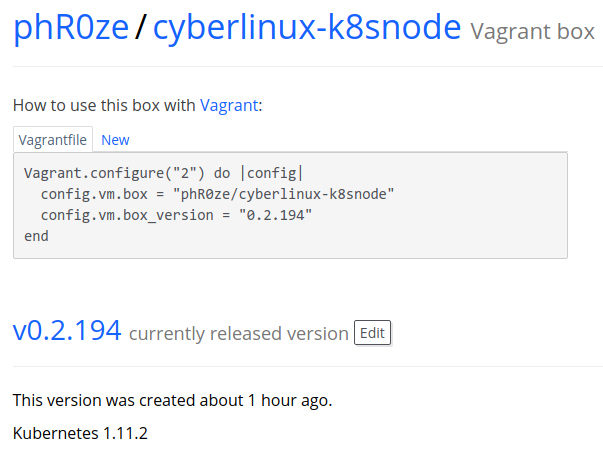

# Kubinator
***Kubinator*** provides deployment automation for Kubernetes


<b><i>Kubinator</i></b> is a <a href="https://github.com/phR0ze/cyberlinux">cyberlinux</a> backed project leveraging the pre-packed
<a href="https://app.vagrantup.com/phR0ze/boxes/cyberlinux-k8snode">cyberlinux Vagrant box</a>

providing Kubinator with the ability to <b><i>deploy a new K8s cluster in under 10 minutes</i></b>

***Kubinator*** can quickly deploy a K8s cluster with customizable VMs, manage vm snapshots and
automate cluster customizations all from a single simple command line.

[](https://travis-ci.org/phR0ze/kubinator)

## Disclaimer
***kubinator*** comes with absolutely no guarantees or support of any kind. It is to be used at
your own risk.  Any damages, issues, losses or problems caused by the use of ***kubinator*** are
strictly the responsiblity of the user and not the developer/creator of ***kubinator***.

### Table of Contents
* [Kubinator Overview](#kubinator-overview)
  * [Kubeadm](#kubeadm)
  * [CNI Plugins](#cni-plugins)
* [Deploy Kubinator](#deploy-kubinator)
  * [Deploy on cyberlinux](#deploy-on-cyberlinux)
  * [Deploy on Arch Linux](#deploy-on-arch-linux)
  * [Deploy on Ubuntu](#deploy-on-ubuntu)
* [Deploy Kubernetes](#deploy-kubernetes)
  * [Vagrant Node Access](#vagrant-node-access)

## Kubinator Overview <a name="kubinator-overview"/></a>
***Kubinator*** uses Ruby to automate the management/orchestration of the Virtual Machines backing
the Kubernetes cluster. ***Kubinator*** orchestrates [Vagrant](https://www.vagrantup.com/intro/index.html)
to then in turn pull the strings of [VirtualBox](https://www.virtualbox.org/). Kubinator is able to
get a new Kubernetes cluster up and running in under 10 minutes by using a pre-built [Vagrant
box](https://app.vagrantup.com/phR0ze/boxes/cyberlinux-k8snode) as the base of Virtual Machines
backing the K8s cluster.
<a href="doc/images/vagrantup-k8snode.jpg"></a>

### Kubeadm <a name="kubeadm"/></a>
https://kubernetes.io/docs/setup/independent/create-cluster-kubeadm/

***Kubinator*** leverages ***kubeadm*** which is a Kubernetes project designed to be a simple way
for new users to start trying Kubernetes out, possibly for the first time, a way for existing users
to test their application on and stitch together a cluster easily, and also to be a building block
in other ecosystem and/or installer tool with a larger scope.

***kubeadm*** is currently in Beta but expecred to graduate to ***General Availability (GA) in
2018***

### CNI Plugins <a name="cni-plugins"/></a>
Documentation on how to get container networking up and running is not detailed enough.  I spent a
few house trying to determine why I was missing either the ***loopback*** plugin when attempting to
configure weave or the ***portmap*** plugin when attempting to configure flannel.  I finally
realized that the Container Networking project was split into two pieces, the CNI utility and the
[CNI plugins](https://github.com/containernetworking/plugins).

The ***cyberlinux*** project contains my packaging of CNI https://github.com/phR0ze/cyberlinux/blob/master/aur/kubernetes/PKGBUILD

## Deploy Kubinator <a name="deploy-kubinator"/></a>
There is no ***host*** Linux distribution requirements here other than something that supports
***VirtualBox***, ***Vagrant*** and ***Ruby***, however [cyberlinux](http://github.com/phR0ze/cyberlinux)
is the fastest way to get up and running as most of the dependencies are baked in.

***kubectl*** and ***helm*** are required to be installed on the host environment to manage the
cluster remotely.

### Deploy on cyberlinux <a name="deploy-on-cyberlinux"/></a>
```bash
# Install deps, run:
sudo pacman -S kubectl helm

# Clone kubinator
git clone https://github.com/phR0ze/kubinator.git

# Install ruby gems
cd kubinator
bundle install --system
```

### Deploy on Arch Linux <a name="deploy-on-arch-linux"/></a>
```bash
# Add cyberlinux repo to pacman config
sudo tee -a /etc/pacman.conf <<EOL
[cyberlinux]
SigLevel = Optional TrustAll
Server = https://phr0ze.github.io/cyberlinux-repo/$repo/$arch
EOL

# Install deps, run:
sudo pacman -Sy
sudo pacman -S virtualbox vagrant ruby ruby-bundler kubectl helm

# Clone kubinator
git clone https://github.com/phR0ze/kubinator.git

# Install ruby gems
cd kubinator
bundle install --system
```

### Deploy on Ubuntu <a name="deploy-on-unbutu"/></a>
I've validated with Ubuntu 16.04 and the following versions

* ruby 2.3.1
* vagrant 1.8.1
* virtualbox 5.0.32

```bash
# Install deps, run:
sudo apt-get install virtualbox vagrant ruby ruby-dev

# Install kubectl
curl -LO https://storage.googleapis.com/kubernetes-release/release/$(curl -s https://storage.googleapis.com/kubernetes-release/release/stable.txt)/bin/linux/amd64/kubectl
chmod +x kubectl
sudo mv kubectl /usr/local/bin/

# Install Helm
curl https://raw.githubusercontent.com/kubernetes/helm/master/scripts/get > get_helm.sh
chmod 700 get_helm.sh
./get_helm.sh

# Clone kubinator
git clone https://github.com/phR0ze/kubinator.git

# Install ruby gems
sudo gem install bundler --no-user-install
bundle install --system
```

## Deploy Kubernetes <a name="deploy-kubernetes"/></a>
By default ***Kubinator*** will deploy 3 ***cyberlinux-k8snode*** vms with 2 cpus and 2GB RAM ea. on
which to deploy Kubernetes.

Deploying a development Kubernetes cluster with kubinator is a few simple steps:

1. Deploy vagrant nodes
  ```bash
  ./kubinator deploy
  ```

2. Take snapshot of nodes prior to clustering  
  ```bash
  ./kubinator snap save
  ```

3. Deploy K8s on vagrant nodes  
  ```bash
  ./kubinator cluster init
  ```

4. Access k8s cluster  
  The deployment process will configure a ***kubernetes-admin@kubernetes*** context
  ```bash
  kubectl config use-context kubernetes-admin@kubernetes
  # Example: kubectl get po --all-namespaces -o wide
  ```

### Node Networking <a name="node-networking"/></a>
Each node is configured with two network interface cards:  
1. One configured as a NAT with the host for access to the external world
2. One configured on a host-only network for node to node communication

### Vagrant Node Access
You can access the nodes using *vagrant* for your username and password  
```bash
# Example shell into a node:
ssh vagrant@192.168.56.10

# Example scp out a file:
scp vagrant@192.168.56.10:/etc/kubernetes/kubelet.conf .
```

<!-- 
vim: ts=2:sw=2:sts=2
-->
